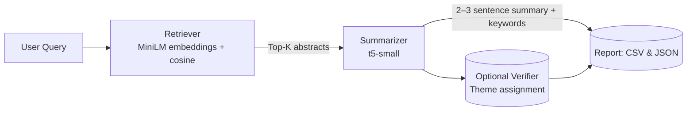

# case-study
Sanofi Case Study

## Architecture



Retriever: sentence-transformers/all-MiniLM-L6-v2

Summarizer: t5-small (distilled BART fallback is supported)

Verifier: labels like Deep Learning / Clinical Trial / Traditional Methods

##  How to Run

> Requirements: Python 3.9+ (3.10 recommended), ~2 GB free disk, internet access to read the public S3 bucket.

### Setup the notebook/dependencies
```bash
python -m venv .venv
# Windows: .venv\Scripts\activate
source .venv/bin/activate
pip install --upgrade pip
pip install "transformers>=4.42" "torch>=2.2" "sentence-transformers>=2.2" \
            s3fs "pandas>=2.2" "numpy>=1.26" "scikit-learn>=1.4" "tqdm>=4.66"
jupyter notebook
```

## Design Choices & Trade-offs

**Scope & runtime**  
- **Decision:** Work on a small subset (< 100 docs) with **seeded sampling**.  
- **Why:** Keeps runs fast on CPU and makes results reproducible.  
- **Trade-off:** Smaller corpus can miss some relevant items. (Upgrade path: increase subset size or pre-index a larger cache.)

**Retrieval**  
- **Decision:** `sentence-transformers/all-MiniLM-L6-v2` embeddings + **cosine similarity** over **L2-normalized** vectors (NumPy, in-memory).  
- **Why:** Strong semantic signal at low cost; no extra infrastructure required.  
- **Trade-off:** Not as scalable as a vector DB and no lexical (BM25) hybrid by default.  
  - *Upgrade path:* FAISS/pgvector for scale; optional BM25+embeddings hybrid.

**Parsing**  
- **Decision:** Heuristic **title/abstract** extractor tailored to PMC TXT (handles “Front” blocks, content-type lines, true **Abstract** headers).  
- **Why:** Robust enough for varied publishers while avoiding heavy PDF parsing.  
- **Trade-off:** Occasional edge cases.  
  - *Upgrade path:* section-aware parsing or a structured parser (e.g., GROBID) when needed.

**Summarization**  
- **Decision:** **t5-small** (with distilled BART fallback) producing **2-3 sentence** summaries.  
- **Why:** CPU-friendly, predictable lengths for scanability.  
- **Trade-off:** Smaller models are faster but less nuanced than larger LLMs.  
  - *Upgrade path:* larger summarizers or task-specific prompting when compute allows.

**Keywords**  
- **Decision:** Per-doc **TF-IDF** to extract a few topical terms.  
- **Why:** Zero training, very fast, good for quick scanning.  
- **Trade-off:** Purely lexical (not concept-aware).  
  - *Upgrade path:* KeyBERT or embedding-based keyphrase extraction.

**Verifier (optional)**  
- **Decision:** Zero-shot/similarity theme tag (**Deep Learning / Clinical Trial / Traditional Methods**).  
- **Why:** Adds quick triage without training.  
- **Trade-off:** Coarse and not production-grade.  
  - *Upgrade path:* fine-tuned domain classifier or curated zero-shot labels.

**Simplicity & infra**  
- **Decision:** **In-memory index** (NumPy) and **direct S3 reads** via `s3fs`.  
- **Why:** Fewer moving parts; easy to understand and demo.  
- **Trade-off:** Some networks block anonymous listing; less suited to very large corpora.  
  - *Fallback:* use AWS CLI to pre-download a small local subset.  
  - *Scale path:* switch to FAISS/pgvector and batch S3 ingestion.

**Outputs & reviewability**  
- **Decision:** Emit both **CSV** and **JSON** with retrieval **scores**.  
- **Why:** Easy to inspect, grade, and integrate into downstream tools.  
- **Trade-off:** None significant for this scope.